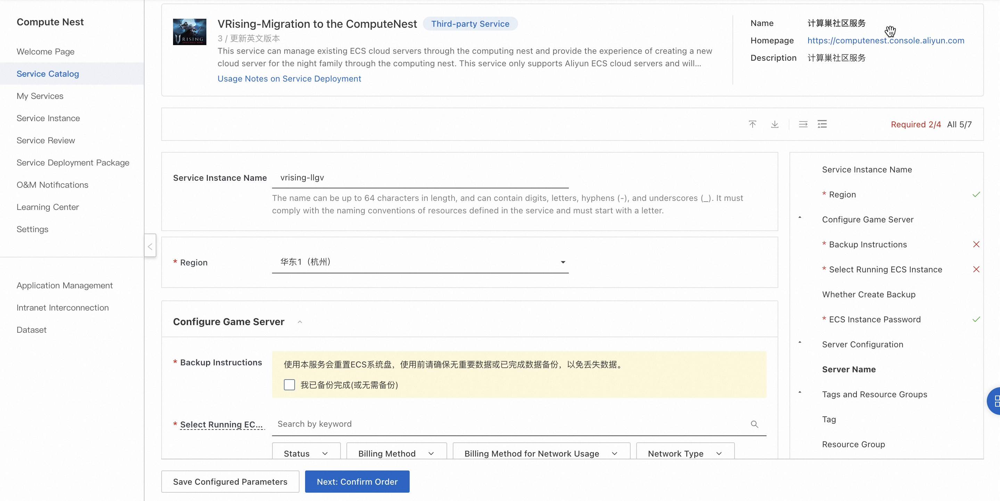
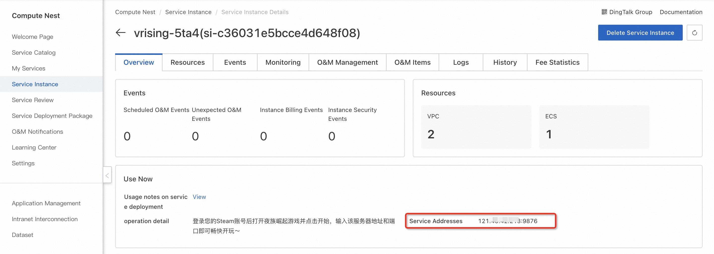
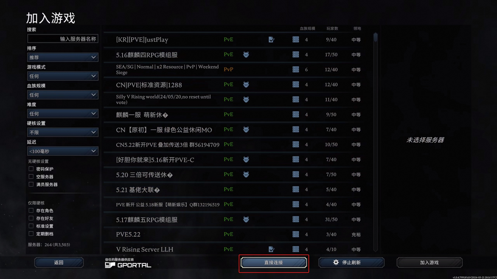
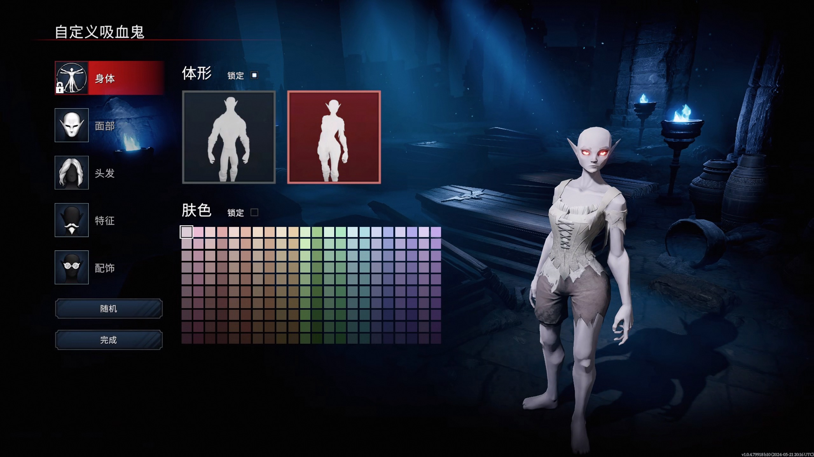

<h1>5 minutes, migrate the Night Family Rise server to the computing nest </h1>

 The migration process is simple:

<ol start="1">
<li>
Create a computing nest night family rise migration service instance

</li>
<li>
 After the service instance is created, obtain the service address on the details page

</li>
<li>
 log in to the game account, choose to connect directly to the server, paste the address of the computing nest server and join the server

</li>
<li>
 Start the game!

</li>
</ol>
